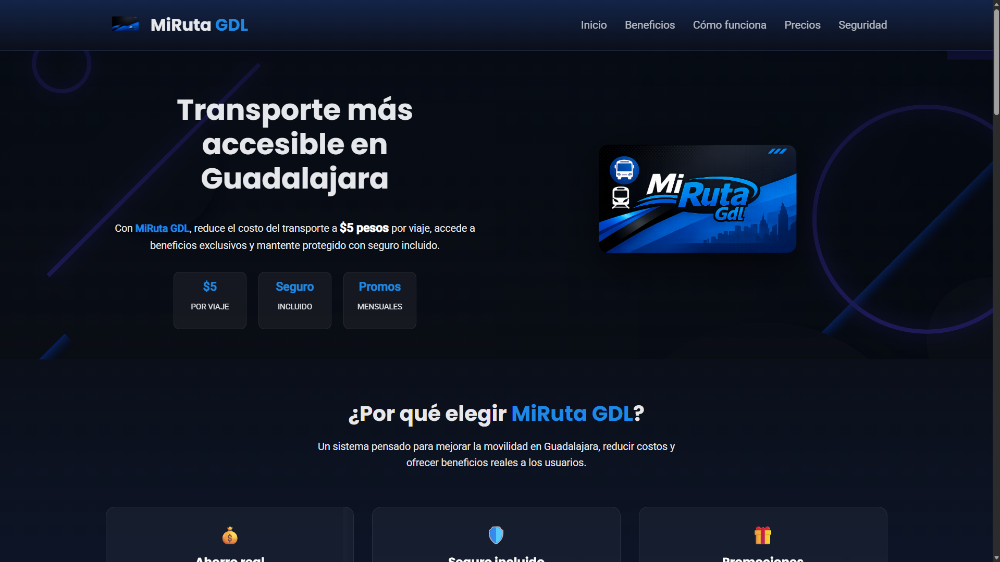

# Mi Ruta GDL

## 📸 Preview


Landing page desarrollada como proyecto académico enfocada en la presentación visual de un servicio de transporte en Guadalajara. El proyecto destaca por su enfoque en diseño UI/UX, animaciones y organización profesional del código frontend.

## 🧠 Objetivo

Construir una interfaz moderna, atractiva y funcional que comunique información de manera clara mediante componentes visuales, animaciones y estructura modular.

## 🚀 Tecnologías utilizadas

* HTML5
* SCSS (Sass)
* JavaScript (Vanilla)
* Gulp (automatización de tareas)
* PostCSS / Autoprefixer / CSSNano

## ⚙️ Funcionalidades implementadas

* Menú responsive con interacción dinámica
* Animaciones al hacer scroll (Intersection Observer)
* Animación de entrada en hero
* Slider automático en sección de precios
* Sistema de tabs interactivos en sección de seguridad
* Cierre automático del menú en navegación

## 🧱 Flujo de trabajo con Gulp

El proyecto utiliza Gulp para automatizar tareas como:

* Compilación de SCSS a CSS
* Minificación de CSS
* Generación de sourcemaps
* Optimización de imágenes
* Conversión de imágenes a formatos WebP y AVIF
* Watch de archivos para desarrollo en tiempo real

## 📦 Instalación

1. Clonar el repositorio
2. Instalar dependencias:

```bash id="g1x0w2"
npm install
```

3. Ejecutar entorno de desarrollo:

```bash id="g1x0w3"
gulp
```

## 📁 Estructura del proyecto

* `/src` → código fuente (SCSS, imágenes)
* `/build` → archivos optimizados para producción
* `/js` → scripts de interacción

## 🎯 Enfoque del proyecto

Este proyecto no se enfoca en lógica backend, sino en:

* Experiencia de usuario (UX)
* Diseño visual (UI)
* Organización de código escalable
* Flujo de desarrollo profesional

## 👨‍💻 Autor

Andres Ramirez
